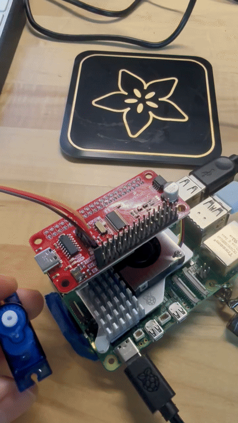
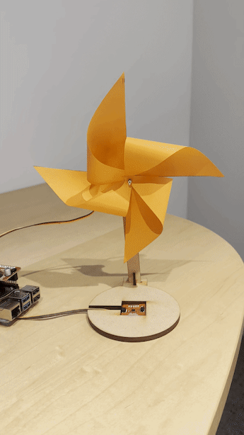
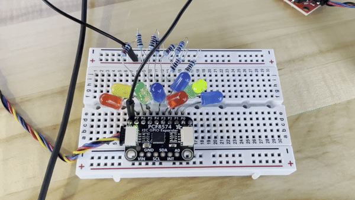

# Ph-UI!!!

<details>
	<summary><strong>Instructions for Students (Click to Expand)</strong></summary>
  
	**Submission Cleanup Reminder:**
	- This README.md contains extra instructional text for guidance.
	- Before submitting, remove all instructional text and example prompts from this file.
	- You may delete these sections or use the toggle/hide feature in VS Code to collapse them for a cleaner look.
	- Your final submission should be neat, focused on your own work, and easy to read for grading.
  
	This helps ensure your README.md is clear, professional, and uniquely yours!
</details>

---

---

## Lab Overview
Team: <canvas group name>  
Members: Full Name (netid, github-handle), ...  
Clock name: <name>


For lab this week, we focus on both sensing and actuation, bringing new modes of input and output into your devices, while also prototyping the physical structure and overall look of the device. You will consider how the physical form supports sensing and actuation, and how these elements come together to shape the interaction and aesthetics of the device.

---

## Lab Structure

A) [Capacitive Sensing](#part-a)

B) [More Sensors](#part-b)

C) [Servo Actuation](#part-c)

D) [Physical Interaction Design: Feast Automata](#part-d)

E) [Build & Integrate](#part-e)

F) [Final Documentation](#part-f)

---

## Part 1 Lab Preparation

---

### Get the latest content:
As always, pull updates from the class Interactive-Lab-Hub to both your Pi and your own GitHub repo. As we discussed in the class, there are 3 ways you can do so:


Option 1: On the Pi, `cd` to your `Interactive-Lab-Hub`, pull the updates from upstream (class lab-hub) and push the updates back to your own GitHub repo. You will need the personal access token for this.
```
pi@ixe00:~$ cd Interactive-Lab-Hub
pi@ixe00:~/Interactive-Lab-Hub $ git pull upstream Fall2026
pi@ixe00:~/Interactive-Lab-Hub $ git add .
pi@ixe00:~/Interactive-Lab-Hub $ git commit -m "get lab4 content"
pi@ixe00:~/Interactive-Lab-Hub $ git push
```

Option 2: On your own GitHub repo, [create pull request](https://github.com/FAR-Lab/Developing-and-Designing-Interactive-Devices/blob/2021Fall/readings/Submitting%20Labs.md) to get updates from the class Interactive-Lab-Hub. After you have latest updates online, go on your Pi, `cd` to your `Interactive-Lab-Hub` and use `git pull` to get updates from your own GitHub repo.

Option 3: (preferred) use the Github.com interface to update the changes.

---

### Quick Start: Python Environment Setup

1. **Create and activate a virtual environment in Lab 4:**
	```bash
	cd ~/Interactive-Lab-Hub/Lab\ 4
	python3 -m venv .venv
	source .venv/bin/activate
	```
2. **Install all Lab 4 requirements:**
	```bash
	pip install -r requirements2025.txt
	```
3. **Check CircuitPython Blinka installation:**
	```bash
	python blinkatest.py
	```
	If you see "Hello blinka!", your setup is correct. If not, follow the troubleshooting steps in the file or ask for help.

---

### Gathering materials for this lab:

* Cardboard (start collecting those shipping boxes!)
* Found objects and materials--like bananas and twigs.
* Cutting board
* Cutting tools
* Markers


(We do offer shared cutting board, cutting tools, and markers on the class cart during the lab, so do not worry if you don't have them!)

---

### Prototyping References 

* [What do prototypes prototype?](https://www.semanticscholar.org/paper/What-do-Prototypes-Prototype-Houde-Hill/30bc6125fab9d9b2d5854223aeea7900a218f149)
* [Paper prototyping](https://www.uxpin.com/studio/blog/paper-prototyping-the-practical-beginners-guide/) is used by UX designers to quickly develop interface ideas and run them by people before any programming occurs. 
* [Cardboard prototypes](https://www.youtube.com/watch?v=k_9Q-KDSb9o) help interactive product designers to work through additional issues, like how big something should be, how it could be carried, where it would sit. 
* [Tips to Cut, Fold, Mold and Papier-Mache Cardboard](https://makezine.com/2016/04/21/working-with-cardboard-tips-cut-fold-mold-papier-mache/) from Make Magazine.
* [Surprisingly complicated forms](https://www.pinterest.com/pin/50032245843343100/) can be built with paper, cardstock or cardboard.  The most advanced and challenging prototypes to prototype with paper are [cardboard mechanisms](https://www.pinterest.com/helgangchin/paper-mechanisms/) which move and change. 
* [Dyson Vacuum Cardboard Prototypes](http://media.dyson.com/downloads/JDF/JDF_Prim_poster05.pdf)
<p align="center"> </p>

### Feast Automata Inspirations

* [Simone Giertz - The Breakfast Machine](https://www.youtube.com/watch?v=E2evC2xTNWg) turns an everyday breakfast routine into a deliberately awkward robotic performance.
* [Pee-wee’s Big Adventure - Breakfast Machine](https://www.classhook.com/resources/1295-pee-wee-s-big-adventure-pee-wee-s-breakfast-machine?utm_source=chatgpt.com) An elaborate Rube Goldberg-style machine turns the ordinary routine of making breakfast into a playful mechanical performance.
* [Wallace & Gromit - The Autochef](https://www.google.com/search?sca_esv=66d2cd5ecf989ed9&sxsrf=APpeQnuwAWHrA3R0b1GeoQ4r-spKos3vUQ:1789367781228&udm=7&fbs=ABfTbFVyMZGZf1hfvX9uKjN_-G8cxpBkeIeqYwoCbfNVc4vKE7plZzta63Pe5DpJ3XFR9XzI_yj6fb6bfPt1x_5u3nRcG7tR9jg4Omd7-UnDuaw5i86wRQqe-045kPXObjb1eDS649ikhB0y_hSFYfNioDnA60A2i_oC1IzIZywb7ERnDQqnSx10JnfJEaAauzJXglx4123_vjf0_54bKrF6QjM9ne5i3g&q=Wallace+%26+Gromit+%E2%80%94+The+Autochef&sa=X&ved=2ahUKEwiI0OO3uu2WAxVHEFkFHQ3iAOEQtKgLegQIFRAB&biw=1197&bih=613&dpr=2.5#fpstate=ive&vld=cid:72c3eb07,vid:2igRcGxlshA,st:0)
* [Nik Ramage - Jelly Wobbler](http://www.youtube.com/watch?v=pj2t71q68sY#t=33) makes the simple act of wobbling jelly into a dedicated machine.
* [Zekun Chang - Blah Blah](https://zekunchang.com/portfolio/blah-blah/) is an alcohol machine that presents a playful commentary on drunken behavior.

### Mechanical Prototyping Resource

* [Gear Template Generator](https://woodgears.ca/gear_cutting/template.html) can help you prototype simple gear mechanisms for translating servo motion into physical movement.


---

### Part A
### Capacitive Sensing, a.k.a. Human-Twizzler Interaction 

We want to introduce you to the [capacitive sensor](https://learn.adafruit.com/adafruit-mpr121-gator) in your kit. It's one of the most flexible input devices we are able to provide. At boot, it measures the capacitance on each of the 12 contacts. Whenever that capacitance changes, it considers it a user touch. You can attach any conductive material. In your kit, you have copper tape that will work well, but don't limit yourself! In the example below, we use Twizzlers--you should pick your own objects.


<p float="left">

 
</p>

Plug in the capacitive sensor board with the QWIIC connector. Connect your Twizzlers with either the copper tape or the alligator clips (the clips work better). Install the latest requirements from your working virtual environment:

These Twizzlers are connected to pads 6 and 10. When you run the code and touch a Twizzler, the terminal will print out the following

```
(circuitpython) pi@ixe00:~/Interactive-Lab-Hub/Lab 4 $ python cap_test.py 
Twizzler 10 touched!
Twizzler 6 touched!
```

---

### Part B
### More sensors

#### Light/Proximity/Gesture sensor (APDS-9960)

We here want you to get to know this awesome sensor [Adafruit APDS-9960](https://www.adafruit.com/product/3595). It is capable of sensing proximity, light (also RGB), and gesture! 
 

 

Connect it to your pi with Qwiic connector and try running the three example scripts individually to see what the sensor is capable of doing!

```
(circuitpython) pi@ixe00:~/Interactive-Lab-Hub/Lab 4 $ python proximity_test.py
...
(circuitpython) pi@ixe00:~/Interactive-Lab-Hub/Lab 4 $ python gesture_test.py
...
(circuitpython) pi@ixe00:~/Interactive-Lab-Hub/Lab 4 $ python color_test.py
...
```

You can go the the [Adafruit GitHub Page](https://github.com/adafruit/Adafruit_CircuitPython_APDS9960) to see more examples for this sensor!

#### Rotary Encoder 

A rotary encoder is an electro-mechanical device that converts the angular position to analog or digital output signals. The [Adafruit rotary encoder](https://www.adafruit.com/product/4991#technical-details) we ordered for you came with separate breakout board and encoder itself, that is, they will need to be soldered if you have not yet done so! We will be bringing the soldering station to the lab class for you to use, also, you can go to the MakerLAB to do the soldering off-class. Here is some [guidance on soldering](https://learn.adafruit.com/adafruit-guide-excellent-soldering/preparation) from Adafruit. When you first solder, get someone who has done it before (ideally in the MakerLAB environment). It is a good idea to review this material beforehand so you know what to look at.

<p float="left">

   


</p>

Connect it to your pi with Qwiic connector and try running the example script, it comes with an additional button which might be useful for your design!

```
(circuitpython) pi@ixe00:~/Interactive-Lab-Hub/Lab 4 $ python encoder_test.py
```

You can go to the [Adafruit Learn Page](https://learn.adafruit.com/adafruit-i2c-qt-rotary-encoder/python-circuitpython) to learn more about the sensor! The sensor actually comes with an LED (neo pixel): Can you try lighting it up? 

#### Joystick 


A [joystick](https://www.sparkfun.com/products/15168) can be used to sense and report the input of the stick for it pivoting angle or direction. It also comes with a button input!

<p float="left">

</p>

Connect it to your pi with Qwiic connector and try running the example script to see what it can do!

```
(circuitpython) pi@ixe00:~/Interactive-Lab-Hub/Lab 4 $ python joystick_test.py
```

You can go to the [SparkFun GitHub Page](https://github.com/sparkfun/Qwiic_Joystick_Py) to learn more about the sensor!

#### Distance Sensor


Earlier we have asked you to play with the proximity sensor, which is able to sense objects within a short distance. Here, we offer [Sparkfun Proximity Sensor Breakout](https://www.sparkfun.com/products/15177), With the ability to detect objects up to 20cm away.

<p float="left">


</p>

Connect it to your pi with Qwiic connector and try running the example script to see how it works!

```
(circuitpython) pi@ixe00:~/Interactive-Lab-Hub/Lab 4 $ python qwiic_distance.py
```

You can go to the [SparkFun GitHub Page](https://github.com/sparkfun/Qwiic_Proximity_Py) to learn more about the sensor and see other examples

---

### Part C
### Servo Actuation

Now that you have explored several forms of sensing, add physical output by learning to control a servo motor. Complete the Servo pHAT setup and basic servo test before beginning your interaction design.

### Servo Control with SparkFun Servo pHAT
For this lab, you will use the **SparkFun Servo pHAT** to control a micro servo (such as the Miuzei MS18 or similar 9g servo). The Servo pHAT stacks directly on top of the Adafruit Mini PiTFT (135×240) display without pin conflicts:
- The Mini PiTFT uses SPI (GPIO22, 23, 24, 25) for display and buttons ([SPI pinout](https://pinout.xyz/pinout/spi)).
- The Servo pHAT uses I²C (GPIO2 & 3) for the PCA9685 servo driver ([I2C pinout](https://pinout.xyz/pinout/i2c)).
- Since SPI and I²C are separate buses, you can use both boards together.
**⚡ Power:**
- Plug a USB-C cable into the Servo pHAT to provide enough current for the servos. The Pi itself should still be powered by its own USB-C supply. Do NOT power servos from the Pi’s 5V rail.

<p align="center">
    
</p>

**Basic Python Example:**
We provide a simple example script: `Lab 4/pi_servo_hat_test.py` (requires the `pi_servo_hat` Python package).
Run the example:
```
python pi_servo_hat_test.py
```
For more details and advanced usage, see the [official SparkFun Servo pHAT documentation](https://learn.sparkfun.com/tutorials/pi-servo-phat-v2-hookup-guide/all#resources-and-going-further).
A servo motor is a rotary actuator that allows for precise control of angular position. The position is set by the width of an electrical pulse (PWM). You can read [this Adafruit guide](https://learn.adafruit.com/adafruit-arduino-lesson-14-servo-motors/servo-motors) to learn more about how servos work.

---

### Part D
### Physical Interaction Design: Feast Automata

**Feast Automata:** build a device that **transforms ordinary dining rituals into playful physical interactions.** Begin with a familiar experience around eating, drinking, cooking, serving, or sharing food, and explore how sensing and actuation might augment, exaggerate, automate, or reinterpret your dining experience.

In this part, use the sensing techniques from Parts A–B and the servo actuation from Part C to develop a physical interaction.

#### Physical considerations for sensing

Sensors need to be positioned in specific locations or orientations to make them useful for an application. Choose a sensor that fits the dining interaction you want to explore. For example, a distance sensor could detect when a cup is placed on a coaster; where the sensor is positioned determines what it can reliably detect.

Think about how the larger object needs to be shaped so the sensor can work reliably, where the actuator needs to sit, what moves, and how a person encounters the interaction.

#### Physical Form and Housing

Think about how your sensor, actuator, and electronics are physically arranged within your prototype. Consider where components need to be placed, what parts move, how the device is supported or enclosed, and how the overall form and aesthetics shape the interaction.

Use cardboard, paper, found objects, or other low-fidelity materials to quickly prototype the physical structure before refining your final design.

#### Optional Display Feedback: Qwiic OLED

Your kit includes these [SparkFun Qwiic OLED screens](https://www.sparkfun.com/products/17153). These use less power than the MiniTFTs you have mounted on the GPIO pins of the Pi, but, more importantly, they can be more flexibly mounted elsewhere on your physical interface. The way you program this display is almost identical to the way you program a  Pi display. Take a look at `oled_test.py` and some more of the [Adafruit examples](https://github.com/adafruit/Adafruit_CircuitPython_SSD1306/tree/master/examples).

<p float="left">


</p>


As you develop your Feast Automata concept, consider where the sensor and actuator need to be placed, what parts move, how electronics are housed, and how the overall form and aesthetics support the interaction.

**\*\*\*Draw 5 sketches that explore different physical arrangements for your sensing and actuation.\*\*\***

**\*\*\*What questions do these sketches raise? What do you need to physically prototype to answer them?\*\*\***

**\*\*\*Pick one design to prototype and explain why.\*\*\***

Build a cardboard or other low-fidelity physical prototype of your design.

**\*\*\*Document your rough prototype with photos and/or video.\*\*\***

---

## Part 2

Following exploration and reflection from Part 1, complete the "looks like," "works like" and "acts like" prototypes for your design, reiterated below.

---

### Part E

#### Build & Integrate: Sensing + Actuation

For Part 2, build the Feast Automata interaction you developed in Part D by connecting sensing/input to physical actuation.

**Your prototype should:**
- Use at least one sensing or input device.
- Use servo-based physical actuation.
- Connect sensing and actuation into a meaningful interaction around eating, drinking, cooking, serving, or sharing food.
- Additional inputs, displays, LEDs, buttons, or other outputs are optional extensions.

**Document your system with:**
- Code for your sensing + actuation prototype
- Photos and/or video of the working prototype in action
- A simple interaction diagram or sketch showing how sensing and actuation are connected
- Written reflection: What did you learn about connecting sensing, movement, and physical form? What was fun, surprising, or challenging?

**Questions to consider:**
- How does your chosen sensor or input shape the physical response?
- How does the physical arrangement of the sensor and actuator change the interaction?
- What thresholds, timing, or movement patterns make the interaction feel clear or playful?
- What changes when you adjust the sensor placement or servo motion?

Iterate on the sensing, movement, and physical form, and document what you discover.

See encoder_accel_servo_dashboard.py in the Lab 4 folder for an optional example of chaining together three devices.

**`Lab 4/encoder_accel_servo_dashboard.py`**

#### Example Application: Windmill Coaster

Now that you have explored both sensing and actuation, here is a simple example that combines the two.

The **Windmill Coaster** uses a Qwiic distance/proximity sensor to detect when a cup is placed on a coaster. When the cup is detected, a servo motor animates a small windmill by sweeping it back and forth, turning an ordinary action during drinking into a playful physical interaction.

<p align="center">
    
</p>


This example demonstrates a simple interaction pipeline:

**cup placed → distance sensor detects cup → servo actuates windmill**

Connect the Qwiic distance sensor to the Pi and connect the servo to Channel 0 of the Servo pHAT. Make sure the Servo pHAT is powered through its USB-C connection.

Run the example script:

```bash
python windmill_coaster.py
```

The script continuously reads the proximity value from the distance sensor. When the value passes a threshold, the servo begins animating the windmill. When the cup is removed, the servo stops and returns to its resting position.

You may need to adjust `CUP_THRESHOLD` in [`windmill_coaster.py`](windmill_coaster.py) depending on the size of your cup and the physical placement of the sensor. You can run `qwiic_distance.py` first to compare readings with and without a cup.

Use this example as a starting point. Change the sensor, movement, physical form, or dining interaction to create your own Feast Automata variation.

#### Optional Extensions

The following examples are optional resources if you want to add more inputs or outputs to your prototype.

##### Using Multiple Qwiic Buttons: Changing I2C Address (Physically & Digitally)

If you want to use more than one Qwiic Button in your project, you must give each button a unique I2C address. There are two ways to do this:

##### 1. Physically: Soldering Address Jumpers

On the back of the Qwiic Button, you'll find four solder jumpers labeled A0, A1, A2, and A3. By bridging these with solder, you change the I2C address. Only one button on the chain can use the default address (0x6F).

**Address Table:**

| A3 | A2 | A1 | A0 | Address (hex) |
|----|----|----|----|---------------|
|  0 |  0 |  0 |  0 |    0x6F       |
|  0 |  0 |  0 |  1 |    0x6E       |
|  0 |  0 |  1 |  0 |    0x6D       |
|  0 |  0 |  1 |  1 |    0x6C       |
|  0 |  1 |  0 |  0 |    0x6B       |
|  0 |  1 |  0 |  1 |    0x6A       |
|  0 |  1 |  1 |  0 |    0x69       |
|  0 |  1 |  1 |  1 |    0x68       |
|  1 |  0 |  0 |  0 |    0x67       |
| ...| ...| ...| ... |     ...      |

For example, if you solder A0 closed (leave A1, A2, A3 open), the address becomes 0x6E.

**Soldering Tips:**
- Use a small amount of solder to bridge the pads for the jumper you want to close.
- Only one jumper needs to be closed for each address change (see table above).
- Power cycle the button after changing the jumper.

##### 2. Digitally: Using Software to Change Address

You can also change the address in software (temporarily or permanently) using the example script `qwiic_button_ex6_changeI2CAddress.py` in the Lab 4 folder. This is useful if you want to reassign addresses without soldering.

Run the script and follow the prompts:
```bash
python qwiic_button_ex6_changeI2CAddress.py
```
Enter the new address (e.g., 5B for 0x5B) when prompted. Power cycle the button after changing the address.

**Note:** The software method is less foolproof and you need to make sure to keep track of which button has which address!


##### Using Multiple Buttons in Code

After setting unique addresses, you can use multiple buttons in your script. See these example scripts in the Lab 4 folder:

- **`qwiic_1_button.py`**: Basic example for reading a single Qwiic Button (default address 0x6F). Run with:
	```bash
	python qwiic_1_button.py
	```

- **`qwiic_button_led_demo.py`**: Demonstrates using two Qwiic Buttons at different addresses (e.g., 0x6F and 0x6E) and controlling their LEDs. Button 1 toggles its own LED; Button 2 toggles both LEDs. Run with:
	```bash
	python qwiic_button_led_demo.py
	```

Here is a minimal code example for two buttons:
```python
import qwiic_button

# Default button (0x6F)
button1 = qwiic_button.QwiicButton()
# Button with A0 soldered (0x6E)
button2 = qwiic_button.QwiicButton(0x6E)

button1.begin()
button2.begin()

while True:
		if button1.is_button_pressed():
				print("Button 1 pressed!")
		if button2.is_button_pressed():
				print("Button 2 pressed!")
```

For more details, see the [Qwiic Button Hookup Guide](https://learn.sparkfun.com/tutorials/qwiic-button-hookup-guide/all#i2c-address).

---

##### PCF8574 GPIO Expander: Add More Pins Over I²C

Sometimes your Pi’s header GPIO pins are already full (e.g., with a display or HAT). That’s where an I²C GPIO expander comes in handy.

We use the Adafruit PCF8574 I²C GPIO Expander, which gives you 8 extra digital pins over I²C. It’s a great way to prototype with LEDs, buttons, or other components on the breadboard without worrying about pin conflicts—similar to how Arduino users often expand their pinouts when prototyping physical interactions.

**Why is this useful?**
- You only need two wires (I²C: SDA + SCL) to unlock 8 extra GPIOs.
- It integrates smoothly with CircuitPython and Blinka.
- It allows a clean prototyping workflow when the Pi’s 40-pin header is already occupied by displays, HATs, or sensors.
- Makes breadboard setups feel more like an Arduino-style prototyping environment where it’s easy to wire up interaction elements.

**Demo Script:** `Lab 4/gpio_expander.py`

<p align="center">
    
</p>

We connected 8 LEDs (through 220 Ω resistors) to the expander and ran a little light show. The script cycles through three patterns:
- Chase (one LED at a time, left to right)
- Knight Rider (back-and-forth sweep)
- Disco (random blink chaos)

Every few runs, the script swaps to the next pattern automatically:
```bash
python gpio_expander.py
```

This is a playful way to visualize how the expander works, but the same technique applies if you wanted to prototype buttons, switches, or other interaction elements. It’s a lightweight, flexible addition to your prototyping toolkit.

---


---

---

### Part F

### Final Documentation

Document all the prototypes and iterations you have designed and worked on! Again, deliverables for this lab are writings, sketches, photos, and videos that show what your prototype:
* "Looks like": shows how the device should look, feel, sit, weigh, etc.
* "Works like": shows what the device can do
* "Acts like": shows how a person would interact with the device

---

## Deliverables \& Submission for Lab 4

The deliverables for this lab are, writings, sketches, photos, and videos that show what your prototype:
* "Looks like": shows how the device should look, feel, sit, weigh, etc.
* "Works like": shows what the device can do.
* "Acts like": shows how a person would interact with the device.

For submission, the readme.md page for this lab should be edited to include the work you have done:
* Upload any materials that explain what you did, into your lab 4 repository, and link them in your lab 4 readme.md.
* Link your Lab 4 readme.md in your main Interactive-Lab-Hub readme.md. 
* Labs are due on Mondays, make sure to submit your Lab 4 readme.md to Canvas.
